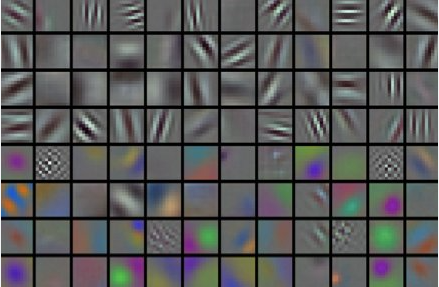
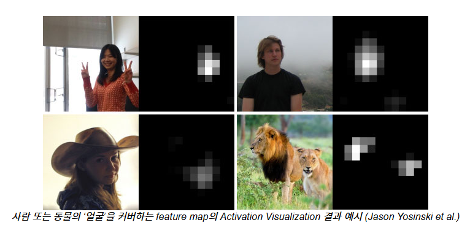

# SCV

블록 코딩 인터페이스를 이용한 딥러닝 개발 플랫폼 프로젝트의 후기입니다.

- 기간 : 2024. 10. 14. ~ 2024. 11. 19
- 팀 구성
  - BE (모델 관련 CRUD)
  - BE (Github oauth, Github import / export)
  - AI (블록-모델 변환, 유효성 검증 (Back-End), 데이터 전처리, )
  - FE
  - Infra (CPU 서버 구성, CI/CD)
  - **Me!** (AI, Infra, FE)
- 역할
  - AI
    - 모델 테스트 API 작성
    - MinIO를 사용한 모델 관리
    - 모델 분석
      - 유사 모델 검색
      - confusion matrix
        - 가장 confidence 가 높은 이미지 추출
      - 시각화
        - feature activation
        - activation maximization
  - FE
    - 블록 유효성 검증 (Front-End)
  - Infra
    - GPU 서버 구성
    - GPU 서버 Deployments, Service 작성
    - FastAPI Docker 이미지 생성

## 기획

- 딥러닝을 처음 접하는 사람에서부터 이미 경험해본 사람들 까지 **모두가 쓸 수 있는 플랫폼**을 만들자.
- 딥러닝의 블랙박스를 해결하기 위해 설명력을 제공하는 기능들을 탑재하자.
  - 후에 이 설명력을 시각적으로 제공할 수 있는 **컴퓨터 비전 영역을 선택**하게 됨.
- **MLOps** 철학을 이식하자.
  - 새로운 데이터셋, 모델 과 모델 버전 등의 관리를 신경써서 설계해 추후 확장성을 확보하자.
  - MinIO 오브젝트 스토리지를 접목시키는 계기가 됨.

## 기능 구현

### 1. 유사 모델 검색

크게 두 개의 고민 포인트가 있었다.

- 모델 간의 유사도를 어떻게 정의할 것인가?
- 전체 모델을 순회 하는 데에 너무 오래 걸리지 않았으면 좋겠다. $O(N)$

모델의 파라미터 개수나 레이어 구성과 같은 메타 데이터를 이용해서 클러스터링 기반의 유사도 검색을 시도할 수도 있었지만, 해당 Feature들로 유사한 모델을 검색한다는게 그리 설득력 있어 보이지 않았다.

그러다 CKA(Centered Kernel Alignment) 를 알게 되었고, 해당 metric이 데이터셋과 함께 레이어 내부에 학습된 파라미터 까지 고려할 수 있는 metric이라는 점이 매력적이어서 선택했다. (정확히는 공통된 데이터에 대해서 해당 레이어의 출력을 사용한다.)

구체적인 구현사항은 다음과 같다.

1. Milvus Vector db 에 Convolution layer의 CKA Vector를 저장한다.
2. Milvus Vector db 로 내적(Inner Product) 유사도를 측정해 가장 높은 유사도의 레이어를 반환하는 API를 작성한다.

다음은 Milvus Vector db의 Schema이다. CKA Vector를 만들기 위해 dataset은 100개를 사용한다. 즉, 100 \* `# Feature` 의 행렬을 $A$ 라 했을 때, $AA^T$가 Milvus에 저장된다. 이 행렬은 100 \* 100 크기이고, 이를 vector로 일렬로 쭉 펴서 (Flatten) 저장하기 때문에 10000 길이의 vector 가 된다.

```python
from pymilvus import connections, db, FieldSchema, CollectionSchema, Collection, DataType, MilvusClient
from dotenv import load_dotenv
import os


load_dotenv(verbose=True)
db_name = os.getenv("DB_NAME")
collection_name = os.getenv("COLLECTION_NAME")
# milvus_host_name = os.getenv("MILVUS_HOST_NAME")
# milvus_port = os.getenv("MILVUS_PORT")

# conn = connections.connect(host=milvus_host_name, port=milvus_port)

# if not db_name in db.list_database():
#     database = db.create_database(db_name)

client = MilvusClient(
    uri="/data/scv_milvus.db"
)

# db.using_database(db_name)

id_field = FieldSchema(
    name="model_version_layer_id",
    dtype=DataType.VARCHAR,
    max_length=30,
    is_primary=True,
    description="model, version, layer id 를 concat 해서 사용")

model_version_field = FieldSchema(
    name="model_version_id",
    dtype=DataType.VARCHAR,
    max_length=30,
    description="model, version를 concat함. delete 요청에 사용")

accuracy_field = FieldSchema(
    name="test_accuracy",
    dtype=DataType.FLOAT,
    description="test 정확도")

layer_field = FieldSchema(
    name="layers",
    dtype=DataType.VARCHAR,
    max_length=1024,
    description="모델의 레이어 정보를 담은 JSON 파일"
)

vector_field = FieldSchema(
    name="cka_vec",
    dtype=DataType.FLOAT_VECTOR,
    dim=10000,
    description="cka 행렬 X 의 XX^T 를 취한 후에 Frobenius Norm으로 나눈 값")


schema = CollectionSchema(fields=[id_field, model_version_field, accuracy_field, layer_field, vector_field], description="collection with cka. pk is model_version_layer_id")

index_params = client.prepare_index_params()

index_params.add_index(
    field_name="model_version_layer_id",
    index_type="INVERTED"
)

index_params.add_index(
    field_name="cka_vec",
    index_type="FLAT",
    metric_type="IP",
)

index_params.add_index(
    field_name="model_version_id",
    index_type="INVERTED"
)

client.create_collection(
    collection_name="cka_collection",
    schema=schema,
    index_params=index_params
)

client.release_collection(
    collection_name="cka_collection"
)
```

다음은 실제 FastAPI의 한 Endpoint 이다. 모델의 id, 버전 id, 레이어 id 를 받아야 레이어 하나가 결정되기 때문에 Path Variable로 받고 있다. 성능이 더 좋은 모델, 혹은 같은 데이터셋에만 해당하는 모델 등 SQL 조건을 걸어줄 수 있다. 실제로 마지막 `filter="model_version_id != '{}'".format(model_version_id)` 부분을 제외할 경우 항상 같은 레이어가 결과로 출력되는 것을 확인함으로써 본 기능이 잘 작동하고 있음을 검증할 수 있었다. (실제 CKA metric을 검증할 때도 같은 방법을 사용한다.)

```python
# 유사 모델 검색
@app.get("/{model_id}/{version_id}/{layer_id}/search", response_model=Model_Search_Response)
async def search_model(model_id: str, version_id: str, layer_id: str):
    model_version_layer_id = "{}_{}".format(f"model_{model_id}_v{version_id}", layer_id)
    model_version_id = f"model_{model_id}_v{version_id}"
    cached = redis.get(model_version_layer_id)
    if cached:
        print("응답이 캐싱되었습니다.")
        cached = json.loads(cached)
        cached["layers"] = deserialize_layers(cached["layers"])
        return cached

    model = client.get(
        collection_name=collection_name,
        ids=[model_version_layer_id]
    )

    if (len(model) == 0):
        raise InvalidModelId(model_version_layer_id)

    model = model[0]

    print("{} id로 가장 유사한 레이어를 검색합니다.".format(model_version_layer_id))

    results = client.search(
        collection_name=collection_name,
        data=[model["cka_vec"]],
        anns_field="cka_vec",
        output_fields=["model_version_layer_id", "test_accuracy", "cka_vec", "layers"],
        search_params={"metric_type": "IP"},
        limit=1,
        filter="model_version_id != '{}'".format(model_version_id)
        # 성능이 더 좋은 모델만 찾아주려면, 아무 것도 찾지 못했을 수 있음
        # filter="test_accuracy > {}".format(model[0]["test_accuracy"])
    )

    if (len(results[0]) == 0):
        raise LayerNotFound()

    results = dict(results[0][0])

    id_parse = results["id"].split("_")
    searched_model_version_id = id_parse[0] + id_parse[1] + id_parse[2]
    searched_layer_id = id_parse[1]
    searched_test_accuracy = results["entity"]["test_accuracy"]
    print(f"searched_model_version_id: {searched_model_version_id}")
    target = model["layers"]
    target_test_accuracy = model["test_accuracy"]
    searched = results["entity"]["layers"]

    gpt_description = await get_gpt_answer(target, searched, layer_id, searched_layer_id, target_test_accuracy,
                                           searched_test_accuracy)

    searched = deserialize_layers(searched)

    resp = {"model_version_id": searched_model_version_id, "layer_id": searched_layer_id,
            "gpt_description": gpt_description, "test_accuracy": searched_test_accuracy,
            "layers": serialize_layers(searched)}

    redis.set(model_version_layer_id, json.dumps(resp))
    redis.expire(model_version_layer_id, 3600)

    resp["layers"] = deserialize_layers(resp["layers"])
    return resp
```

다음은 유사 모델을 찾고 나서 두 모델의 구조를 비교하고 그를 바탕으로 성능 개선을 위한 조언을 GPT에게 물어보는 부분이다. 사실 이 부분은 기능 구현에 초점을 맞추었을 뿐 실제 도움이 되는 지에는 그리 집중하지 않았다. 시간이 된다면 프롬프트도 더 갈고 닦고, 실제 도움이 되는지 검증해보고 싶은 마음은 있다.

```python
from openai import AsyncOpenAI
from dotenv import load_dotenv
import os

load_dotenv(verbose=True)
api_key = os.getenv("API_KEY")

gpt_client = AsyncOpenAI(api_key = api_key)
gpt_model = "gpt-4o-mini"

prompt = """
-- Compare <target> model and <searched> model
-- first, compare them in their "Structures"
-- second, compare them in their "Performance", guess the reason why their performances were different.
-- third, with the point that <target> model's <target_layer>th layer(starts from 0) is turned out to be similar with <searched> model's <searched_layer>th layer(starts from 0) by the CKA(centered kernel alignment),
    tell me anything helpful to develop <target> model. guess the reason why two layers were similar.
-- There are no more information to give, so don't ask for further information
-- translate all to Korean.
"""

client = AsyncOpenAI(api_key = api_key)

async def get_gpt_answer(target_layer : str, searched_layer : str, target_layer_id, searched_layer_id, target_test_accuracy, searched_test_accuracy):

    chat_completion = await client.chat.completions.create(
        model= gpt_model,
        messages=[{"role": "user",
        "content": prompt + "<target> {} <target test accuracy> {} \n <searched> {} <searched model test accuracy> {}".format(target_layer, target_test_accuracy, searched_layer, searched_test_accuracy) }]
    )

    return chat_completion.choices[0].message.content
```

다음은 구체적으로 CKA vector가 Milvus에 저장되는 API Endpoint에서 사용하는 함수이다. MinIO에 데이터 셋이 `train`, `test`, `cka` 용도로 분류되어 저장되고 있다. 본 함수에서는 `cka` 데이터셋을 불러오고 (100개) 이를 레이어에 통과시키면서 해당 레이어가 Convolution일 때만 그 출력을 저장한다.

```python
async def save_cka_to_milvus(model, dataset, model_version_id, conv_idx, test_accuracy, layers, device):
    cka_dataset = load_dataset_from_minio(dataset, "cka")
    id_parse = model_version_id.split("_")
    model_id = id_parse[1]
    version_id = id_parse[2][1:]

# Milvus CKA 저장
    cka_matrix = defaultdict(list)
    with torch.no_grad():
        for index, data in enumerate(cka_dataset):
            input = data[0]
            label = data[1]
            input = input.to(device)
            label = label.to(device)
            x = input

            for i in range(0, len(model)):
                x = model[i](x)
                if i in conv_idx:
                    cka_matrix[i].append(torch.flatten(x).cpu().numpy())


    for i in cka_matrix.keys():
        mat = np.array(cka_matrix[i])
        n = mat.shape[0]
        # centering matrix
        H = np.eye(n) - np.ones((n, n)) / n
        cka = (H @ mat @ mat.T @ H).flatten()
        cka_vec = cka / np.linalg.norm(cka)
        async with httpx.AsyncClient() as client:
            res = await client.post(f"http://{fast_match_host_name}:{fast_match_port}/fast/v1/model/match/{model_id}/{version_id}/{i}",
                        json={
                            "test_accuracy": test_accuracy,
                            "layers" : serialize_layers(layers),
                            "cka_vec": cka_vec.tolist()
                        })
            print(res)
```

여기서 다음의 부분이 CKA vector를 만드는 부분에 해당한다.

```python
mat = np.array(cka_matrix[i])
n = mat.shape[0]
# centering matrix
H = np.eye(n) - np.ones((n, n)) / n
cka = (H @ mat @ mat.T @ H).flatten()
cka_vec = cka / np.linalg.norm(cka)
```

### 2. Confusion matrix

scikit-learn 에 있는 confusion matrix를 사용했다. EMNIST 만 label이 26개 (a to z) 이기 때문에 예외처리를 해주어야 했는데, 레이블이 0부터 25가 아니라 1 부터 26이라 또 번거롭게 했다.
MNIST 기준으로 완벽하게 동작하는 서비스를 먼저 만들자는 생각이었기 때문에 코드가 general 하게 짜지지 못하고 EMNIST만을 예외처리하는 방식으로 짜진 것은 아쉬운 부분이다.

```python
    # confusion matrix 를 위한 변수 선언
    true_label = []
    predicted_label = []

    model.eval()
    with torch.no_grad():
        for index, data in enumerate(test_dataset):
            input = data[0]
            label = data[1]
            x = input

            # confusion matrix를 위한 true label 저장
            if (dataset == "emnist"):
                true_label.extend((label-1).numpy())
            else:
                true_label.extend(label.numpy())

            # confusion matrix 를 위한 예측 레이블 저장
            predicted_label.extend(torch.max(x, 1)[1].numpy())

    confusion_matrix = get_confusion_matrix(true_label, predicted_label) # 나
```

### 3. 예제 이미지

Confusion Matrix 상에서 각 칸마다 가장 confidence가 높았던 이미지를 저장한다.
아쉽게도 프론트 인원이 한 명 뿐이라 구현했음에도 결과적으로 서비스에 실리지는 못했다.

```python
def get_example_image(outputs, dataset) -> str:

    data_labels = dataset_labels[dataset]

    example_images = {}

    # 초기화
    for actual in data_labels:
        for pred in data_labels:
            example_images[(actual,pred)] = {
                "conf" : 0.0,
                "image" : "null"
            }

    # 최대 confidence에서만 업데이트
    for i in range(0, len(outputs)):
        input = outputs[i]["input"]
        label = outputs[i]["label"]
        output = outputs[i]["output"]
        label = label.item()
        if dataset == "emnist":
            label = label - 1

        conf, preds = torch.max(torch.softmax(output, dim=1),dim=1)
        conf = conf.item()
        preds = preds.item()
        curr_conf = example_images[(label, preds)]["conf"]
        if conf > curr_conf:
            example_images[(label, preds)] = {
                "conf" : conf,
                "image" : input.tolist()
            }
    return json.dumps({str(key): value for key, value in example_images.items()})
```

### 4. Feature Activation 시각화

지금도 이 기능의 정확한 명칭에 대해서는 헷갈린다. 최초에는 kernel을 시각화하는 것을 구상했었다.
가로, 세로 방향의 gradient를 따는 kernel이나 gaussian kernel이 시각화돼서 보이면 의미가 있을 것이라고 생각했기 때문이었다.
그러나, 기능을 구체화 시키기 위해 공부하면 할 수록 kernel의 시각화는 직관적으로 이해하기가 어렵다는 느낌을 받았다.



그래서 생각한 것이 다음 사진의 feature activation 이미지 였다.



그러나 kernel이 뭐에 집중하고 있을지 모르는 상태에서 위 사진처럼 이쁘게 "얼굴"에 집중하고 있는 커널임이 나올리 만무하다고 생각했다.

결국, 이미지가 layer를 통과한 후에 어떤 이미지가 되는지를 시각적으로 보여주는 것으로 기능을 구체화 했다.

1. 그러면 어떤 이미지로 그 시각화를 보여줄 것인가에 대해서는, 가장 norm이 컸던 이미지를 데이터셋 내에서 선택하는 것으로 정했다.
2. 그래서 모든 데이터를 돌면서 가장 출력층의 norm이 컸던 이미지, 그 이미지의 출력층을 리턴했다.
3. 컨볼루션 레이어는 가장 마지막에 있는 것을 선택했다. (`i == conv_idx[-1]`) 더 깊은 레이어 일 수록 눈으로 관찰 가능한 의미 있는 feature를 추출할 확률이 높다는 점이 그 원인이었다.
4. batch size 는 1이기 때문에 x[0] 에서 순서대로 3개의 이미지를 뽑는다. (`for j in range(0,3)`)

~~다시 돌아보면 논리적으로 좀 빈약한 부분이 있는 듯 하다.~~

```python
    # feature activation map 을 위한 변수 선언
    norm = [0, 0, 0]
    maximization_input = [None, None, None]
    activation_map = [None, None, None]

    outputs = []
    # 테스트
    model.eval()
    with torch.no_grad():
        for index, data in enumerate(test_dataset):
            input = data[0]
            label = data[1]
            x = input

            for i in range(0, len(model)):
                x = model[i](x)
                if i == conv_idx[-1]:
                    for j in range(0,3):
                        curr_norm = torch.norm(x[0][j])
                        if curr_norm > norm[j] :
                            norm[j] = curr_norm
                            activation_map[j] = x[0][j]
                            maximization_input[j] = input

            outputs.append({
                "input" : input,
                "label": label,
                "output": x
            })

    feature_activation = get_feature_activation(maximization_input, activation_map) # 나
```

### 5. Activation Maximization 시각화

랜덤으로 생성된 텐서에서 시작해 특정 레이블의 확률이 최대가 되도록 하는 최적화 기법을 돌려서 이미지를 생성한다. 생각보다 간단하다.

```python
def maximize_class_image(model, target_class, dataset, device, num_steps=100, lr=0.1):
    # 랜덤한 노이즈 이미지 생성 (MNIST: 1x28x28)
    optimized_image = torch.randn((1, dataset_channels[dataset], dataset_width[dataset], dataset_width[dataset]), requires_grad=True)
    optimized_image = optimized_image.to(device)
    # Adam 옵티마이저 설정
    optimizer = Adam([optimized_image], lr=lr)

    for step in range(num_steps):
        optimizer.zero_grad()

        # 모델의 예측 값 계산
        output = model(optimized_image)

        # target class에 대한 점수를 최대화하는 방향으로 손실 계산
        loss = -output[0, target_class]  # 음수를 취하여 최대화 방향으로 최적화

        # 역전파 및 최적화
        loss.backward()
        optimizer.step()

        # 이미지 값 범위 조정 (-1, 1 사이로 클리핑)
        with torch.no_grad():
            optimized_image.clamp_(-1, 1)

    return optimized_image.detach().cpu().squeeze().tolist()
```

### 6. 모델과 데이터셋 관리를 위한 MinIO 사용

MinIO_init.py 를 작성해 초기화한다. MinIO 에는 두 개의 버켓이 존재하고 각각 데이터셋 버켓과 모델 버켓이다. 데이터 셋 버킷은 또 `train`, `test`, `cka`의 세 가지로 분류된다. 모델의 학습 과정은 또 다른 팀원이 작성하고 있기 때문에 거기에 맞추어 `DataLoader`객체로 저장하기로 했고, `batch_size`와 전처리에 쓰이는 수치 등의 변수들을 통일했다.

```python
from minio import Minio
from dotenv import load_dotenv
from io import BytesIO
import os
import pickle

from torchvision.datasets import MNIST, FashionMNIST, CIFAR10, SVHN, EMNIST
from torchvision import transforms

from collections import defaultdict

from time import sleep

from torch.utils.data import Subset
from torch.utils.data import DataLoader


load_dotenv(verbose=True)
minio_user_name=os.getenv("MINIO_ROOT_USER")
minio_user_password=os.getenv("MINIO_ROOT_PASSWORD")
minio_host_name=os.getenv("MINIO_HOST_NAME")
minio_model_bucket=os.getenv("MINIO_MODEL_BUCKET")
minio_dataset_bucket=os.getenv("MINIO_DATASET_BUCKET")
minio_port=os.getenv("MINIO_PORT")

client = Minio("{}:{}".format(minio_host_name, minio_port),
        access_key=minio_user_name,
        secret_key=minio_user_password,
        # SSL 설정 해제
        secure=False
    )

def upload_dataset_to_minio(data, object_name):
    buffer = BytesIO()
    pickle.dump(data, buffer)
    buffer.seek(0)

    client.put_object(
        bucket_name=minio_dataset_bucket,
        object_name=object_name,
        data=buffer,
        length=buffer.getbuffer().nbytes
    )
    print(f"{object_name} 데이터 셋을 업로드 했습니다.")

def upload_cka_dataset_to_minio(test_data, dataset_name):
    indices_per_label = defaultdict(list)
    cnt = 0
    for idx, (image, label) in enumerate(test_data):
        if (len(indices_per_label[label])) < 10:
            indices_per_label[label].append(idx)
            cnt += 1
            if cnt==100:
                break

    for indices in indices_per_label.values() :
        print(len(indices))

    if all(len(indices) == 10 for indices in indices_per_label.values()) or cnt == 100:
        selected_indices = [idx for indices in indices_per_label.values() for idx in indices]
        # Subset에 대한 DataLoader 생성
        subset_loader = DataLoader(Subset(test_data, selected_indices), batch_size=1, shuffle=False)

        # Upload the subset
        upload_dataset_to_minio(subset_loader, f"{dataset_name}_cka")
        print(f"{dataset_name}의 cka 데이터 셋을 업로드 했습니다.")


if not client.bucket_exists(minio_model_bucket):
    client.make_bucket(minio_model_bucket)
if not client.bucket_exists(minio_dataset_bucket):
    client.make_bucket(minio_dataset_bucket)


while not client.bucket_exists(minio_dataset_bucket):
    sleep(2)


# MNIST
mnist_transforms = transforms.Compose([
    transforms.ToTensor(),
    transforms.Normalize(mean=[0.1307], std=[0.3081])
])

# FASHION_MNIST
fashion_mnist_transforms = transforms.Compose([
    transforms.ToTensor(),
    transforms.Normalize(mean=[0.2860], std=[0.3530])
])

# CIFAR10
cifar10_transforms = transforms.Compose([
    transforms.ToTensor(),
    transforms.Normalize(mean=[0.4914, 0.4822, 0.4465], std=[0.2470, 0.2435, 0.2616])
])

# SVHN
svhn_transforms = transforms.Compose([
    transforms.ToTensor(),
    transforms.Normalize(mean=[0.4377, 0.4438, 0.4728], std=[0.1980, 0.2010, 0.1970])
])

# EMNIST
emnist_transforms = transforms.Compose([
    transforms.ToTensor(),
    transforms.Normalize(mean=[0.1751], std=[0.3332])
])

# MNIST 데이터셋
train_dataset_mnist = MNIST(root='/data', train=True, download=True, transform=mnist_transforms)
test_dataset_mnist = MNIST(root='/data', train=False, download=True, transform=mnist_transforms)

# DataLoader 설정
train_loader_mnist = DataLoader(train_dataset_mnist, batch_size=64, shuffle=True)  # 배치 크기 64
test_loader_mnist = DataLoader(test_dataset_mnist, batch_size=1, shuffle=False)    # 배치 크기 1

upload_dataset_to_minio(train_loader_mnist, "mnist_train")
upload_dataset_to_minio(test_loader_mnist, "mnist_test")
upload_cka_dataset_to_minio(test_dataset_mnist, "mnist")

# Fashion-MNIST 데이터셋
train_dataset_fashion_mnist = FashionMNIST(root='/data', train=True, download=True, transform=fashion_mnist_transforms)
test_dataset_fashion_mnist = FashionMNIST(root='/data', train=False, download=True, transform=fashion_mnist_transforms)

# DataLoader 설정
train_loader_fashion_mnist = DataLoader(train_dataset_fashion_mnist, batch_size=64, shuffle=True)  # 배치 크기 64
test_loader_fashion_mnist = DataLoader(test_dataset_fashion_mnist, batch_size=1, shuffle=False)    # 배치 크기 1

upload_dataset_to_minio(train_loader_fashion_mnist, "fashion_mnist_train")
upload_dataset_to_minio(test_loader_fashion_mnist, "fashion_mnist_test")
upload_cka_dataset_to_minio(test_dataset_fashion_mnist, "fashion_mnist")

# CIFAR-10 데이터셋
train_dataset_cifar10 = CIFAR10(root='/data', train=True, download=True, transform=cifar10_transforms)
test_dataset_cifar10 = CIFAR10(root='/data', train=False, download=True, transform=cifar10_transforms)

# DataLoader 설정
train_loader_cifar10 = DataLoader(train_dataset_cifar10, batch_size=64, shuffle=True)  # 배치 크기 64
test_loader_cifar10 = DataLoader(test_dataset_cifar10, batch_size=1, shuffle=False)    # 배치 크기 1

upload_dataset_to_minio(train_loader_cifar10, "cifar10_train")
upload_dataset_to_minio(test_loader_cifar10, "cifar10_test")
upload_cka_dataset_to_minio(test_dataset_cifar10, "cifar10")

# SVHN 데이터셋
train_dataset_svhn = SVHN(root='/data', split='train', download=True, transform=svhn_transforms)
test_dataset_svhn = SVHN(root='/data', split='test', download=True, transform=svhn_transforms)

# DataLoader 설정
train_loader_svhn = DataLoader(train_dataset_svhn, batch_size=64, shuffle=True)  # 배치 크기 64
test_loader_svhn = DataLoader(test_dataset_svhn, batch_size=1, shuffle=False)    # 배치 크기 1

upload_dataset_to_minio(train_loader_svhn, "svhn_train")
upload_dataset_to_minio(test_loader_svhn, "svhn_test")
upload_cka_dataset_to_minio(test_dataset_svhn, "svhn")

# EMNIST 데이터셋
train_dataset_emnist = EMNIST(root='/data', split='letters', train=True, download=True, transform=emnist_transforms)
test_dataset_emnist = EMNIST(root='/data', split='letters', train=False, download=True, transform=emnist_transforms)

# DataLoader 설정
train_loader_emnist = DataLoader(train_dataset_emnist, batch_size=64, shuffle=True)  # 배치 크기 64
test_loader_emnist = DataLoader(test_dataset_emnist, batch_size=1, shuffle=False)    # 배치 크기 1

upload_dataset_to_minio(train_loader_emnist, "emnist_train")
upload_dataset_to_minio(test_loader_emnist, "emnist_test")
upload_cka_dataset_to_minio(test_dataset_emnist, "emnist")
```

- `load_minio.py`

```python
import torch
import io

from minio import Minio
from dotenv import load_dotenv
import os

from exception import ModelNotFound, DataSetNotFound

from typing import Literal
from utils import get_device
import pickle

load_dotenv(verbose=True)
minio_user_name=os.getenv("MINIO_USER_NAME")
minio_user_password=os.getenv("MINIO_USER_PASSWORD")
minio_host_name=os.getenv("MINIO_HOST_NAME")
minio_model_bucket=os.getenv("MINIO_MODEL_BUCKET")
minio_dataset_bucket=os.getenv("MINIO_DATASET_BUCKET")

client = Minio("{}:9002".format(minio_host_name),
        access_key=minio_user_name,
        secret_key=minio_user_password,
        # SSL 설정 해제
        secure=False
    )

def load_model_from_minio(model_version_id : str):
# try:
    obj = client.get_object(
        bucket_name=minio_model_bucket,
        object_name=f"{model_version_id}.pth",
    )
    # 바이트 데이터를 메모리 파일로 변환
    model_bytes = io.BytesIO(obj.read())
    # PyTorch 모델 로드
    model = torch.load(model_bytes, map_location=get_device())
    # model = torch.jit.load(model_bytes, map_location='cpu')
# except:
#     raise ModelNotFound(model_version_id)
# finally:
    obj.close()
    obj.release_conn()
    print(model)
    return model

def load_dataset_from_minio(dataset : Literal["mnist, fashion_mnist, svhn, cifar10, emnist"], kind: Literal["train", "test", "cka"]):
    try:
        obj = client.get_object(
            bucket_name=minio_dataset_bucket,
            object_name=f"{dataset}_{kind}",
        )
                # 바이트 데이터를 메모리 파일로 변환
        dataset_bytes = io.BytesIO(obj.read())
        # PyTorch 모델 로드
        dataset = pickle.load(dataset_bytes)
    except:
        raise DataSetNotFound(f"{dataset}_{kind}")

    return dataset
```
